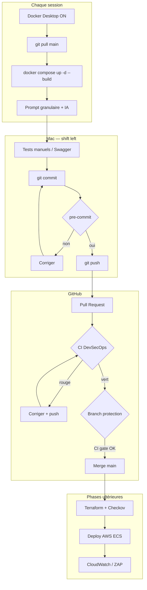
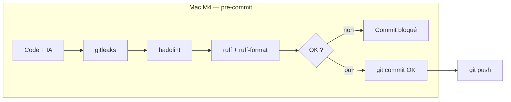
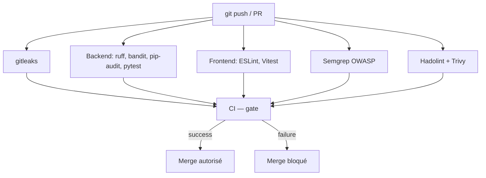

# SINIKO — Prompts granulaires & guide DevSecOps

Document de référence pour le stage **HESTIM / THL** — développement pas à pas (vibe coding maîtrisé).

**Usage** : une session → démarrer l’app → un prompt → valider → Git → PR → merge → prompt suivant.

---

## Table des matières

1. [Contexte projet](#1-contexte-projet)
2. [À chaque session de travail](#2-à-chaque-session-de-travail)
3. [Schémas visuels du workflow](#3-schémas-visuels-du-workflow)
4. [Pipeline DevSecOps — étapes, outils, failles](#4-pipeline-devsecops--étapes-outils-failles)
5. [Stack & architecture](#5-stack--architecture)
6. [Protection de branche](#6-protection-de-branche)
7. [Modèle Git (avant / après chaque prompt)](#7-modèle-git-avant--après-chaque-prompt)
8. [Phase 0 — Fondations](#phase-0--fondations)
9. [Phase 1 — Auth & utilisateurs](#phase-1--auth--utilisateurs)
10. [Phase 2 — Élèves](#phase-2--élèves)
11. [Phase 3 — Notes](#phase-3--notes)
12. [Phase 4 — Comptabilité](#phase-4--comptabilité-mvp)
13. [Phase 5 — Frontend](#phase-5--frontend-par-module)
14. [Phase 6 — DevSecOps+](#phase-6--devsecops-renforcement)
15. [Phase 7 — AWS](#phase-7--aws--iac)
16. [Phase 8 — Supervision](#phase-8--supervision)
17. [Phase 9 — Pentest](#phase-9--tests-offensifs--rapport)
18. [Phase 10 — Optionnels](#phase-10--optionnels)
19. [Index des prompts](#index-rapide-des-prompts)

---

## 1. Contexte projet


| Élément            | Détail                                                                              |
| ------------------ | ----------------------------------------------------------------------------------- |
| **Produit**        | SaaS gestion scolaire                                                               |
| **Objectif stage** | App + DevSecOps + AWS + supervision + pentest                                       |
| **Repo**           | [https://github.com/aroutnous/siniko](https://github.com/aroutnous/siniko) (public) |
| **Référentiel**    | OWASP Top 10                                                                        |


### Rôles métier


| Rôle           | Périmètre                  |
| -------------- | -------------------------- |
| Administrateur | Système, utilisateurs      |
| Directeur      | Consultation, rapports     |
| Secrétariat    | Élèves, classes, documents |
| Comptabilité   | Paiements, reçus           |


---

## 2. À chaque session de travail

Quand vous **reprenez** après avoir tout arrêté (Mac redémarré, `docker compose down`, fermeture Cursor, etc.).

### Checklist de reprise (ordre recommandé)

```bash
# 1. Ouvrir le projet
cd ~/siniko

# 2. Docker Desktop — lancer l’application (baleine active)

# 3. Synchroniser le code
git checkout main
git pull origin main

# 4. Vérifier .env (une seule fois par machine si déjà fait)
test -f .env || cp .env.example .env
# → éditer .env si besoin (secrets, pgAdmin, Grafana)

# 5. Démarrer toute la stack
docker compose up -d --build

# 6. Attendre ~30 s puis vérifier
docker compose ps -a
```

### État attendu (`docker compose ps`)


| Conteneur                                    | STATUS       |
| -------------------------------------------- | ------------ |
| siniko-postgres                              | Up (healthy) |
| siniko-backend                               | Up (healthy) |
| siniko-frontend                              | Up           |
| siniko-pgadmin                               | Up           |
| siniko-grafana, siniko-loki, siniko-promtail | Up           |
| *(aucun Exited sauf anciens tests)*          |              |


### Vérifications rapides

```bash
curl -s http://localhost:8000/health
# → {"status":"ok","service":"siniko-api"}

curl -s -o /dev/null -w "%{http_code}\n" http://localhost:8080/
# → 200
```

### URLs de la session


| Service     | URL                                                                    |
| ----------- | ---------------------------------------------------------------------- |
| API Swagger | [http://localhost:8000/docs](http://localhost:8000/docs)               |
| Frontend    | [http://localhost:8080](http://localhost:8080)                         |
| pgAdmin     | [http://localhost:5050](http://localhost:5050) (host BDD : `postgres`) |
| Grafana     | [http://localhost:3000](http://localhost:3000)                         |


### Si vous travaillez sur une feature en cours

```bash
git checkout feat/VOTRE-BRANCHE
git pull origin feat/VOTRE-BRANCHE   # si déjà poussée
docker compose up -d --build backend   # ou frontend selon le prompt
```

### Commandes utiles pendant la session

```bash
docker compose logs -f backend          # suivre l’API
docker compose exec backend pytest     # tests Python
docker compose up -d --build backend   # après modif code backend
docker compose up -d --build frontend  # après modif front
pre-commit run --all-files             # avant grosse PR
```

### Fin de session (arrêt propre)

```bash
docker compose stop          # arrête les conteneurs, garde les données
# ou
docker compose down          # idem
# docker compose down -v     # ⚠️ SUPPRIME les données Postgres locales
```

---

## 3. Schémas visuels du workflow

### 3.1 — Vue globale (session → production)




### 3.2 — pre-commit (détail — votre stack locale)




### 3.3 — CI GitHub (Pull Request)




---

## 4. Pipeline DevSecOps — étapes, outils, failles

Chaque étape : **objectif**, **outil**, **faille / risque OWASP** couvert, **quand**, **bloque quoi**.


| #   | Étape                | Outil / technologie                 | Objectif                            | Faille / vulnérabilité visée                                | Exécution       | Bloque                |
| --- | -------------------- | ----------------------------------- | ----------------------------------- | ----------------------------------------------------------- | --------------- | --------------------- |
| 0   | Vibe coding          | Cursor + IA                         | Produire le code vite               | Code non sécurisé, secrets copiés, logique fausse           | Développement   | — (relecture humaine) |
| 1   | Code source          | **Git**, **GitHub**                 | Versionner, auditer, PR             | Pas de traçabilité, push direct sur prod                    | Continu         | —                     |
| 1b  | Protection branche   | GitHub Rules                        | Impossible de merger sans CI        | Contournement des contrôles                                 | Config `main`   | **Merge**             |
| 2   | CI orchestration     | **GitHub Actions**                  | Automatiser les contrôles           | Incohérence entre postes dev                                | Push / PR       | —                     |
| 3a  | SAST                 | **Semgrep**                         | Patterns vulnérables dans le code   | **A03 Injection**, **A01 Broken Access Control**, XSS, etc. | CI              | Merge*                |
| 3b  | SAST Python          | **Ruff**, **Bandit**                | Qualité + patterns Python dangereux | `eval`, SQL brut, imports risqués                           | pre-commit + CI | Commit / Merge*       |
| 3c  | SAST / qualité front | **ESLint**, **TypeScript**          | JS/TS sûr                           | **A03 XSS**, code mort, erreurs types                       | CI              | Merge*                |
| 3d  | Qualité globale      | **SonarCloud** (opt.)               | Hotspots, dette, couverture         | Multiples catégories OWASP                                  | CI si activé    | Merge*                |
| 4   | SCA                  | **pip-audit**, **npm audit**        | CVE dans les dépendances            | **A06 Vulnerable Components** (Log4j, etc.)                 | CI              | Merge*                |
| 4b  | SCA + mises à jour   | **Dependabot**, **Snyk** (opt.)     | PR de bump + scan avancé            | Composants obsolètes                                        | GitHub / CI     | Merge*                |
| 5a  | Lint Dockerfile      | **Hadolint**                        | Dockerfile durcis                   | **A05 Misconfiguration**, root, image `latest`              | pre-commit + CI | Commit / Merge*       |
| 5b  | Scan image           | **Trivy**                           | CVE OS/paquets dans l’image         | **A06**, image compromise                                   | CI              | Merge*                |
| 6   | Registre             | **GHCR** / **ECR**                  | Images versionnées post-CI          | Déploiement d’image non scannée                             | Phase AWS       | —                     |
| 7   | CD                   | **ECS Fargate**, **ALB**, **ACM**   | Déploiement reproductible           | **A05** exposition réseau                                   | Phase 7         | —                     |
| 8a  | Secrets Git          | **gitleaks**                        | Pas de clé dans le repo             | **A02** secrets exposés, fuite credentials                  | pre-commit + CI | **Commit** / Merge*   |
| 8b  | Secrets runtime      | **.env`**, **AWS Secrets Manager**  | Secrets hors code                   | Fuite JWT/DB en clair                                       | Runtime         | —                     |
| 8c  | Auth applicative     | **bcrypt**, **JWT**                 | Mots de passe & sessions            | **A07 Auth Failures**, credentials faibles                  | App (P1)        | —                     |
| 9a  | Logs                 | **structlog** JSON                  | Traçabilité, alertes                | **A09 Logging Failures**                                    | Runtime         | —                     |
| 9b  | Supervision locale   | **Loki**, **Grafana**, **Promtail** | Détection brute force, 5xx          | **A07** brute force, intrusion                              | Docker local    | —                     |
| 9c  | Supervision prod     | **CloudWatch**                      | Alarmes prod                        | Attaque non détectée                                        | AWS P8          | —                     |
| 9d  | SIEM (opt.)          | **Wazuh** (ECS amd64)               | Corrélation SIEM                    | APT, scans (optionnel)                                      | AWS             | —                     |
| 10  | DAST                 | **OWASP ZAP**, **Burp**             | Tester l’app en marche              | Ce que le SAST ne voit pas (headers, IDOR HTTP)             | Post-deploy P9  | —                     |
| 11  | IaC scan             | **Terraform**, **Checkov**          | Infra AWS sécurisée                 | SG 0.0.0.0/0, S3 public, RDS ouvert                         | CI `iac.yml`    | Merge*                |
| —   | **CI — gate**        | Job agrégateur                      | Une seule porte pour GitHub         | Toute régression ci-dessus                                  | CI              | **Merge***            |


 Merge bloqué si : repo **public** + branch protection + check **CI — gate** requis.

> Détail long : [pipeline-securite.md](pipeline-securite.md)

---

## 5. Stack & architecture


| Couche     | Technologie                                             |
| ---------- | ------------------------------------------------------- |
| Backend    | FastAPI 3.12, SQLAlchemy, Alembic                       |
| Frontend   | React 18, Vite, TypeScript                              |
| BDD        | PostgreSQL 16                                           |
| Conteneurs | Docker Compose — `siniko-backend`, `siniko-frontend`, … |
| CI         | `.github/workflows/ci.yml`                              |


---

## 6. Protection de branche

1. **Settings → Branches → Add classic branch protection rule**
2. Pattern : `main`
3. **Require a pull request** + **Require status checks**
4. Ajouter le check : `**CI — gate`**
5. **Save**

---

## 7. Modèle Git (avant / après chaque prompt)

Remplacez `BRANCHE` et `MESSAGE` dans chaque section.

### Git — AVANT le prompt

```bash
cd ~/siniko
git checkout main
git pull origin main
git checkout -b BRANCHE

# Reprise stack (si pas déjà Up)
docker compose up -d --build
curl -s http://localhost:8000/health
```

### Git — APRÈS validation du prompt

```bash
# 1. Vérifier l’app (adapter selon prompt)
docker compose up -d --build backend    # et/ou frontend
docker compose logs backend | tail -30
docker compose exec backend pytest      # si backend touché

# 2. Pre-commit (automatique au commit, ou test manuel)
pre-commit run --all-files              # optionnel

# 3. Commit
git status
git add -A                              # ou fichiers ciblés
git commit -m "MESSAGE"                 # → hooks pre-commit

# 4. Push + PR (site GitHub)
git push -u origin BRANCHE
# → github.com/aroutnous/siniko → « Compare & pull request »
# → Base: main ← Compare: BRANCHE
# → Attendre CI verte (job « CI — gate »)

# 5. Après merge sur GitHub
git checkout main
git pull origin main
git branch -d BRANCHE                     # optionnel
```

---

## Phase 0 — Fondations


| ID    | Statut | Sujet                    |
| ----- | ------ | ------------------------ |
| P0-01 | ✅      | Bootstrap                |
| P0-02 | ✅      | Repo public + protection |
| P0-03 | ⬜      | CI verte sur `main`      |


### P0-03 — Stabiliser la CI

**Branche** : `fix/ci-green`

#### Git — avant

```bash
cd ~/siniko
git checkout main && git pull origin main
git checkout -b fix/ci-green
docker compose up -d --build
```

#### Prompt à envoyer

```text
Analyse les échecs de la dernière CI GitHub Actions sur siniko (jobs gitleaks, backend, frontend, docker) et corrige le minimum pour obtenir une CI verte sur main. Ne touche pas au métier. Documente la cause dans docs/troubleshooting.md si pertinent.
```

#### Git — après

```bash
pre-commit run --all-files
git add -A
git commit -m "fix(ci): pipeline DevSecOps verte sur main"
git push -u origin fix/ci-green
# PR → main → merge si CI — gate ✅
git checkout main && git pull origin main
```

**Done** : Actions `main` = Success. **Vérif** : GitHub → Actions.

---

## Phase 1 — Auth & utilisateurs

### P1-01 — Modèles User, Role, association

**Branche** : `feat/P1-01-models-user-role` · **Prérequis** : P0-03

#### Git — avant

```bash
cd ~/siniko
git checkout main && git pull origin main
git checkout -b feat/P1-01-models-user-role
docker compose up -d --build
```

#### Prompt à envoyer

```text
Étape auth 1/7 — Backend uniquement.

Créer les modèles SQLAlchemy :
- Role : id, name (enum : admin, directeur, secretariat, comptabilite), description optionnelle
- User : id, email unique, password_hash, full_name, is_active, created_at, updated_at
- Table d’association user_roles (many-to-many)

Générer la migration Alembic autogenerate. Pas d’endpoints API encore.
Respecter : docstrings, pas de secret en dur, conventions du repo siniko.
```

#### Git — après

```bash
docker compose up -d --build backend
docker compose logs backend | tail -20
docker compose exec backend alembic current
git add backend/
git commit -m "feat(auth): modèles User, Role et migration Alembic"
git push -u origin feat/P1-01-models-user-role
# PR → merge
git checkout main && git pull origin main
```

**Done** : tables en pgAdmin. **Vérif** : [http://localhost:5050](http://localhost:5050)

---

### P1-02 — Hash bcrypt

**Branche** : `feat/P1-02-password-hash` · **Prérequis** : P1-01

#### Git — avant

```bash
cd ~/siniko
git checkout main && git pull origin main
git checkout -b feat/P1-02-password-hash
docker compose up -d --build backend
```

#### Prompt à envoyer

```text
Étape auth 2/7 — Sécurité mots de passe.

Ajouter backend/app/services/password.py : hash_password, verify_password (bcrypt).
Tests pytest. Pas d’API publique encore.
```

#### Git — après

```bash
docker compose exec backend pytest tests/ -q -k password
git add backend/
git commit -m "feat(auth): hash bcrypt et tests"
git push -u origin feat/P1-02-password-hash
git checkout main && git pull origin main
```

---

### P1-03 — JWT access + refresh

**Branche** : `feat/P1-03-jwt-tokens` · **Prérequis** : P1-02

#### Git — avant

```bash
cd ~/siniko
git checkout main && git pull origin main
git checkout -b feat/P1-03-jwt-tokens
docker compose up -d --build backend
```

#### Prompt à envoyer

```text
Étape auth 3/7 — JWT.

backend/app/services/jwt.py : create_access_token, create_refresh_token, decode_token.
JWT_SECRET_KEY et durées depuis Settings. Tests unitaires.
```

#### Git — après

```bash
docker compose exec backend pytest -q
git add backend/
git commit -m "feat(auth): service JWT access et refresh"
git push -u origin feat/P1-03-jwt-tokens
git checkout main && git pull origin main
```

---

### P1-04 — POST /auth/login et /auth/refresh

**Branche** : `feat/P1-04-auth-endpoints` · **Prérequis** : P1-03

#### Git — avant

```bash
cd ~/siniko
git checkout main && git pull origin main
git checkout -b feat/P1-04-auth-endpoints
docker compose up -d --build backend
```

#### Prompt à envoyer

```text
Étape auth 4/7 — Endpoints.

POST /api/v1/auth/login, POST /api/v1/auth/refresh.
401 génériques, rate limiting basique. Pydantic + tests httpx.
Seed admin de test documenté.
```

#### Git — après

```bash
curl -s http://localhost:8000/health
docker compose exec backend pytest -q
# Test manuel : http://localhost:8000/docs
git add backend/
git commit -m "feat(auth): endpoints login et refresh JWT"
git push -u origin feat/P1-04-auth-endpoints
git checkout main && git pull origin main
```

---

### P1-05 — Middleware RBAC

**Branche** : `feat/P1-05-rbac` · **Prérequis** : P1-04

#### Git — avant

```bash
cd ~/siniko
git checkout main && git pull origin main
git checkout -b feat/P1-05-rbac
docker compose up -d --build backend
```

#### Prompt à envoyer

```text
Étape auth 5/7 — RBAC.

get_current_user (Bearer), require_roles(...), GET /api/v1/auth/me protégée.
Tests 401, 403, 200.
```

#### Git — après

```bash
docker compose exec backend pytest -q
git add backend/
git commit -m "feat(auth): middleware RBAC et route /auth/me"
git push -u origin feat/P1-05-rbac
git checkout main && git pull origin main
```

---

### P1-06 — CRUD utilisateurs (admin)

**Branche** : `feat/P1-06-users-crud` · **Prérequis** : P1-05

#### Git — avant

```bash
cd ~/siniko
git checkout main && git pull origin main
git checkout -b feat/P1-06-users-crud
docker compose up -d --build backend
```

#### Prompt à envoyer

```text
Étape auth 6/7 — CRUD users admin.

/api/v1/users : list, get, create, patch, soft delete, gestion rôles. RBAC admin.
```

#### Git — après

```bash
docker compose exec backend pytest -q
git add backend/
git commit -m "feat(auth): CRUD utilisateurs réservé admin"
git push -u origin feat/P1-06-users-crud
git checkout main && git pull origin main
```

---

### P1-07 — Journal d’audit admin

**Branche** : `feat/P1-07-audit-log` · **Prérequis** : P1-06

#### Git — avant

```bash
cd ~/siniko
git checkout main && git pull origin main
git checkout -b feat/P1-07-audit-log
docker compose up -d --build backend
```

#### Prompt à envoyer

```text
Étape auth 7/7 — Audit.

Modèle AuditLog, migration, log auto sur actions admin, GET /api/v1/audit-logs.
Pas de données sensibles en clair dans les logs.
```

#### Git — après

```bash
docker compose exec backend pytest -q
git add backend/
git commit -m "feat(auth): journal d audit des actions admin"
git push -u origin feat/P1-07-audit-log
git checkout main && git pull origin main
```

---

## Phase 2 — Élèves

### P2-01 — Modèles Class, Student, Enrollment

**Branche** : `feat/P2-01-models-students` · **Prérequis** : P1-05

#### Git — avant

```bash
cd ~/siniko && git checkout main && git pull origin main
git checkout -b feat/P2-01-models-students
docker compose up -d --build backend
```

#### Prompt à envoyer

```text
Module élèves 1/5 — Modèles Class, Student, Enrollment + migration Alembic. Pas d’API.
```

#### Git — après

```bash
docker compose up -d --build backend
docker compose exec backend alembic current
git add backend/ && git commit -m "feat(students): modèles et migration"
git push -u origin feat/P2-01-models-students
git checkout main && git pull origin main
```

---

### P2-02 — CRUD élèves

**Branche** : `feat/P2-02-students-crud` · **Prérequis** : P2-01

#### Git — avant / après

```bash
# avant
git checkout main && git pull && git checkout -b feat/P2-02-students-crud
docker compose up -d --build backend
```

```text
Module élèves 2/5 — CRUD /api/v1/students, RBAC secretariat/admin, tests.
```

```bash
# après
docker compose exec backend pytest -q
git add backend/ && git commit -m "feat(students): API CRUD élèves"
git push -u origin feat/P2-02-students-crud
git checkout main && git pull origin main
```

---

### P2-03 — Affectation classe

**Branche** : `feat/P2-03-enrollment`

#### Git — avant

```bash
git checkout main && git pull && git checkout -b feat/P2-03-enrollment
docker compose up -d --build backend
```

#### Prompt

```text
Module élèves 3/5 — POST enroll, PATCH classe, historique par année.
```

#### Git — après

```bash
docker compose exec backend pytest -q
git add backend/ && git commit -m "feat(students): affectation classe"
git push -u origin feat/P2-03-enrollment
git checkout main && git pull origin main
```

---

### P2-04 — Recherche avancée

**Branche** : `feat/P2-04-students-search`

#### Git — avant / après (même schéma)

```bash
git checkout main && git pull && git checkout -b feat/P2-04-students-search
docker compose up -d --build backend
```

```text
Module élèves 4/5 — Filtres q, class_id, level, year, pagination.
```

```bash
docker compose exec backend pytest -q
git add backend/ && git commit -m "feat(students): recherche et filtres"
git push -u origin feat/P2-04-students-search
git checkout main && git pull origin main
```

---

### P2-05 — Export CSV

**Branche** : `feat/P2-05-students-export`

#### Git — avant / après

```bash
git checkout main && git pull && git checkout -b feat/P2-05-students-export
docker compose up -d --build backend
```

```text
Module élèves 5/5 — GET export CSV, RBAC, minimisation RGPD.
```

```bash
git add backend/ && git commit -m "feat(students): export CSV"
git push -u origin feat/P2-05-students-export
git checkout main && git pull origin main
```

---

## Phase 3 — Notes

Pour **P3-01** à **P3-05**, appliquez le même schéma Git :


| ID    | Branche                          | Commit suggéré                             |
| ----- | -------------------------------- | ------------------------------------------ |
| P3-01 | `feat/P3-01-models-grades`       | `feat(grades): modèles Subject Term Grade` |
| P3-02 | `feat/P3-02-grades-crud`         | `feat(grades): CRUD notes`                 |
| P3-03 | `feat/P3-03-averages`            | `feat(grades): calcul moyennes`            |
| P3-04 | `feat/P3-04-bulletin`            | `feat(grades): bulletin PDF/HTML`          |
| P3-05 | `feat/P3-05-class-dashboard-api` | `feat(grades): stats par classe`           |


#### Git — avant (exemple P3-01)

```bash
git checkout main && git pull && git checkout -b feat/P3-01-models-grades
docker compose up -d --build backend
```

#### Prompts (résumé)

- **P3-01** : Modèles Subject, Term, Grade + migration  
- **P3-02** : CRUD `/api/v1/grades` + RBAC  
- **P3-03** : Service moyennes + `report-card`  
- **P3-04** : Bulletin HTML/PDF  
- **P3-05** : `GET /classes/{id}/grades/summary`

#### Git — après (chaque prompt)

```bash
docker compose up -d --build backend
docker compose exec backend pytest -q
git add … && git commit -m "MESSAGE"
git push -u origin BRANCHE
# PR → merge → git checkout main && git pull
```

---

## Phase 4 — Comptabilité (MVP)


| ID    | Branche                        | Commit suggéré                     |
| ----- | ------------------------------ | ---------------------------------- |
| P4-01 | `feat/P4-01-models-payments`   | `feat(finance): modèle Payment`    |
| P4-02 | `feat/P4-02-payments-crud`     | `feat(finance): CRUD paiements`    |
| P4-03 | `feat/P4-03-receipt`           | `feat(finance): reçu PDF`          |
| P4-04 | `feat/P4-04-finance-dashboard` | `feat(finance): dashboard impayés` |


**Git avant** : `git checkout main && git pull && git checkout -b BRANCHE` + `docker compose up -d --build backend`  

**Git après** : pytest → commit → push → PR → `git pull` sur main.

#### Prompts (texte complet)

**P4-01** : `Payment` model + Alembic.  
**P4-02** : CRUD paiements RBAC comptabilite.  
**P4-03** : `GET /payments/{id}/receipt`.  
**P4-04** : `GET /finance/summary`.

---

## Phase 5 — Frontend par module

Rebuild **frontend** après chaque prompt : `docker compose up -d --build frontend`


| ID    | Branche                     | Commit                           |
| ----- | --------------------------- | -------------------------------- |
| P5-01 | `feat/P5-01-ui-auth`        | `feat(ui): page login et tokens` |
| P5-02 | `feat/P5-02-ui-rbac-routes` | `feat(ui): navigation RBAC`      |
| P5-03 | `feat/P5-03-ui-students`    | `feat(ui): écrans élèves`        |
| P5-04 | `feat/P5-04-ui-grades`      | `feat(ui): saisie notes`         |
| P5-05 | `feat/P5-05-ui-payments`    | `feat(ui): comptabilité`         |
| P5-06 | `feat/P5-06-ui-admin`       | `feat(ui): admin users et audit` |


#### Git — avant (exemple P5-01)

```bash
git checkout main && git pull && git checkout -b feat/P5-01-ui-auth
docker compose up -d --build
```

#### Prompt P5-01

```text
Frontend 1 — Page login, tokens, intercepteur API, React Router, français.
```

#### Git — après (frontend)

```bash
docker compose up -d --build frontend
# Vérif : http://localhost:8080
cd frontend && npm run lint && npm run test:coverage   # optionnel hors Docker
git add frontend/ && git commit -m "feat(ui): page login et tokens"
git push -u origin feat/P5-01-ui-auth
git checkout main && git pull origin main
```

---

## Phase 6 — DevSecOps (renforcement)


| ID    | Branche                  | Fichiers typiques                  |
| ----- | ------------------------ | ---------------------------------- |
| P6-01 | `chore/P6-01-sonar`      | `sonar-project.properties`, README |
| P6-02 | `chore/P6-02-snyk`       | `.github/workflows/ci.yml`, docs   |
| P6-03 | `chore/P6-03-zap-dast`   | `.github/workflows/zap.yml`        |
| P6-04 | `chore/P6-04-dependabot` | `.github/dependabot.yml`           |


**Git avant** : branche `chore/...` depuis `main`.  
**Git après** : souvent pas besoin de `docker compose` — vérifier **Actions** sur la PR.

---

## Phase 7 — AWS & IaC


| ID    | Branche                 |
| ----- | ----------------------- |
| P7-01 | `feat/P7-01-tf-vpc-rds` |
| P7-02 | `feat/P7-02-tf-ecs`     |
| P7-03 | `feat/P7-03-cd-aws`     |


**Git après** : déclencher aussi workflow `**IaC Security`** (push sur `infra/**`).

```bash
git add infra/ .github/
git commit -m "feat(aws): terraform VPC RDS ECS"
git push -u origin BRANCHE
```

---

## Phase 8 — Supervision


| ID    | Branche                      |
| ----- | ---------------------------- |
| P8-01 | `feat/P8-01-cloudwatch-logs` |
| P8-02 | `feat/P8-02-grafana-alerts`  |
| P8-03 | `feat/P8-03-wazuh-aws`       |


**Vérif locale P8-02** : [http://localhost:3000](http://localhost:3000) (Grafana).

---

## Phase 9 — Tests offensifs & rapport


| ID    | Branche                        | Type        |
| ----- | ------------------------------ | ----------- |
| P9-01 | `docs/P9-01-pentest-scenarios` | docs        |
| P9-02 | `fix/P9-02-zap-findings`       | code + docs |
| P9-03 | `docs/P9-03-threat-model`      | docs        |


**Git après P9-02** : joindre captures ZAP au rapport de stage.

---

## Phase 10 — Optionnels


| ID     | Sujet                           |
| ------ | ------------------------------- |
| P10-01 | Mobile Money                    |
| P10-02 | Carte scolaire PDF              |
| P10-03 | Photo élève upload sécurisé     |
| P10-04 | Multi-établissement `school_id` |
| P10-05 | Redis rate limit                |


Même schéma Git : `main` → `feat/P10-xx-…` → PR → merge.

---

## Index rapide des prompts


| ID       | Titre       | Branche type      |
| -------- | ----------- | ----------------- |
| P0-03    | CI verte    | `fix/ci-green`    |
| P1-01…07 | Auth        | `feat/P1-xx-…`    |
| P2-01…05 | Élèves      | `feat/P2-xx-…`    |
| P3-01…05 | Notes       | `feat/P3-xx-…`    |
| P4-01…04 | Compta      | `feat/P4-xx-…`    |
| P5-01…06 | Frontend    | `feat/P5-xx-…`    |
| P6-01…04 | DevSecOps+  | `chore/P6-xx-…`   |
| P7-01…03 | AWS         | `feat/P7-xx-…`    |
| P8-01…03 | Supervision | `feat/P8-xx-…`    |
| P9-01…03 | Pentest     | `docs/` ou `fix/` |


---

## Prochain prompt recommandé

1. **Section 2** — checklist reprise si nouvelle session
2. **P0-03** si CI pas verte, sinon **P1-01**

---

## Liens documentation

- [pipeline-securite.md](pipeline-securite.md) — détail OWASP par outil  
- [demarrage.md](demarrage.md) · [workflow-dev.md](workflow-dev.md)  
- [github-branch-protection.md](github-branch-protection.md)  
- [migrations.md](migrations.md) · [troubleshooting.md](troubleshooting.md)

---

### Mes prompts additionnels

